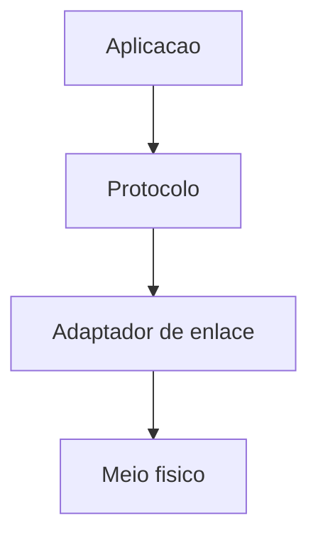
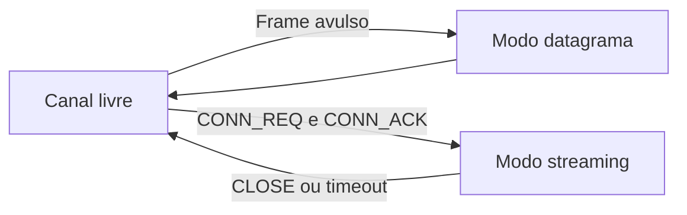
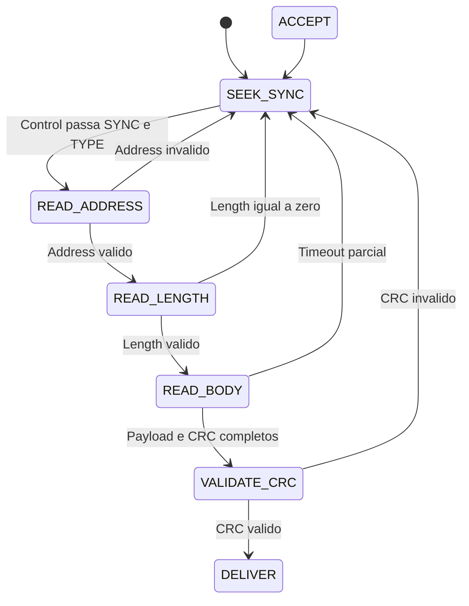
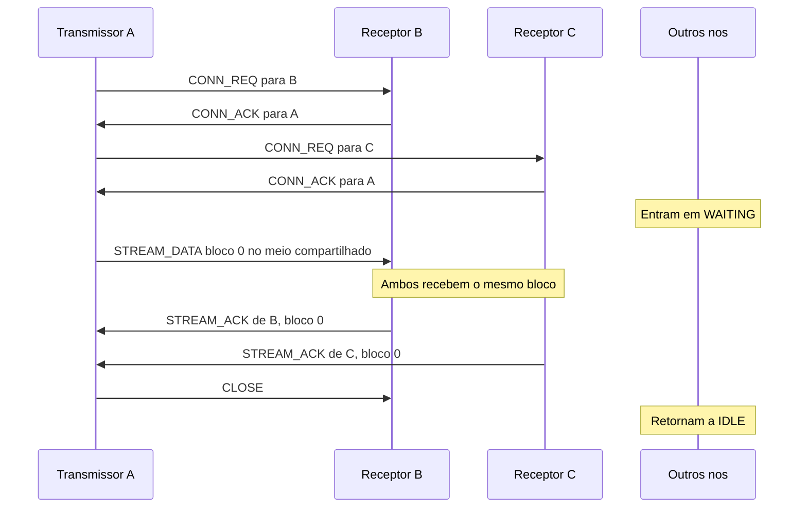
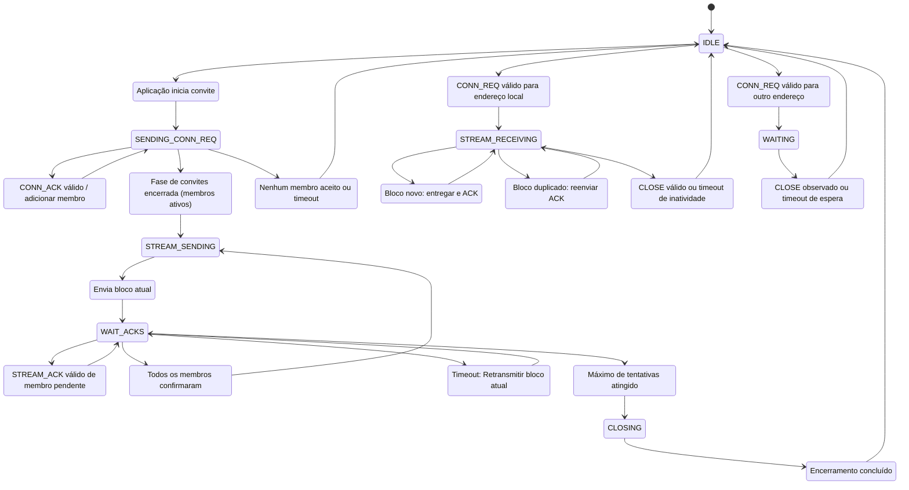

# Protocolo de Comunicacao Agnostico ao Hardware

## Objetivo

Este protocolo define uma camada de comunicacao binaria, compacta e independente de hardware. Ele pode ser implementado sobre qualquer meio que transporte uma sequencia ordenada de bytes, como UART, RS-485, radio, SPI, USB, Ethernet, TCP bruto ou enlaces equivalentes.

O protocolo oferece dois modos: datagrama para mensagens avulsas sem confirmacao e streaming para transferencia confiavel de blocos entre um transmissor e um ou mais receptores.

O protocolo nao usa COBS, byte stuffing, escaping nem byte delimitador de fim. O tamanho declarado no header determina o fim de cada frame normal. Timeouts tratam frames interrompidos, corrompidos ou incompletos.

## Principios

| Principio | Decisao | Motivo |
|---|---|---|
| Agnosticismo | Camada fisica externa ao protocolo | Permite reutilizar o protocolo em diversos transportes |
| Compacidade | Header normal fixo de 3 bytes | Minimiza overhead e simplifica parser |
| Framing por tamanho | Header declara tamanho do payload | Evita byte stuffing e permite todos os valores no payload |
| Integridade | CRC-16 em todos os frames | Detecta erros acidentais de transmissao |
| Latencia baixa | Datagramas nao usam ACK | Evita trafego extra em comandos avulsos |
| Confiabilidade | Streaming usa ACK e retransmissao | Garante entrega de blocos dentro dos limites configurados |
| Enderecamento | IDs de 0 a 255 sao validos | Broadcast usa flag, nao endereco reservado |
| Streaming multiponto | Um transmissor suporta varios receptores | Permite distribuir o mesmo bloco uma unica vez |

---

## Arquitetura



A aplicacao define o significado de `READ`, `WRITE` e dos payloads. O protocolo define framing, integridade, estados, streaming e confirmacoes. O adaptador de enlace transmite e recebe bytes do meio fisico.

---

## Modos de Operacao

### Modo Datagrama

O modo datagrama usa um frame completo para cada mensagem. Nao existe ACK, NACK nem retransmissao definida por esta camada.

Caracteristicas:

- Similar a UDP
- Mensagens podem ser perdidas sem notificacao ao emissor
- Adequado para comandos, telemetria, leitura, escrita, descoberta e broadcast
- Qualquer no pode transmitir quando a politica do meio permitir

### Modo Streaming

O modo streaming e iniciado por handshake. Um transmissor pode convidar um ou mais receptores. Depois de estabelecida a sessao, blocos compactos sao transmitidos no meio compartilhado e cada receptor participante confirma cada bloco com um ACK.

Caracteristicas:

- Um transmissor e um ou mais receptores
- Cada bloco e transmitido uma unica vez no meio compartilhado
- O transmissor espera ACK de todos os membros ativos
- Bloco sem ACK e retransmitido apos timeout
- Nos nao participantes entram em estado `WAITING`
- A sessao termina por `CLOSE`, timeout de inatividade ou falha por tentativas esgotadas



---

## Frame Normal

Frames normais sao usados para datagramas e para mensagens de controle do streaming: `CONN_REQ`, `CONN_ACK`, `STREAM_ACK` e `CLOSE`.

### Estrutura

| Ordem | Campo | Tamanho | Descricao |
|---:|---|---:|---|
| 1 | `control` | 1 byte | Sincronismo, tipo e broadcast |
| 2 | `address` | 1 byte | Destino em unicast ou origem em broadcast |
| 3 | `payload_length` | 1 byte | Quantidade de bytes de payload |
| 4 | `payload` | 1 a 255 bytes | Dados da mensagem |
| 5 | `crc16` | 2 bytes | CRC do header e payload |

Formula do tamanho total:

```text
frame_length = 3 + payload_length + 2
```

| Limite | Valor |
|---|---:|
| Tamanho minimo | 6 bytes, pois payload vazio e proibido |
| Tamanho maximo | 260 bytes |

---

## Header

O header normal possui tres bytes: `control`, `address` e `payload_length`.

### Byte 0: control

| Bits | Campo | Valor ou faixa | Significado |
|---|---|---|---|
| 7..6 | `SYNC` | sempre `11` | Primeiro padrao fixo para identificar candidato a inicio de frame |
| 5..3 | `TYPE` | `000` a `111` | Tipo da mensagem |
| 2 | `BROADCAST` | `0` ou `1` | Define como interpretar `address` |
| 1..0 | `SYNC_EXT` | sempre `01` | Segundo padrao fixo para reforcar deteccao de inicio |

Formula de codificacao:

```text
control = 0xC1 | ((type & 0x07) << 3) | ((broadcast & 0x01) << 2)
```

Validacao do padrao de sincronismo:

```text
(control & 0xC3) == 0xC1
```

O `SYNC` e o `SYNC_EXT` juntos fixam quatro bits do byte. O parser nao aceita um byte como candidato a inicio apenas por conter `11` nos bits mais altos. Ele tambem exige `01` nos dois bits mais baixos.

### Valores de control

| TYPE | Nome | BROADCAST=0, unicast | BROADCAST=1, broadcast | Estado |
|---|---|---:|---:|---|
| `000` | `READ` | `0xC1` | `0xC5` | Definido |
| `001` | `WRITE` | `0xC9` | `0xCD` | Definido |
| `010` | `CONN_REQ` | `0xD1` | `0xD5` | Definido |
| `011` | `CONN_ACK` | `0xD9` | `0xDD` | Definido |
| `100` | `STREAM_ACK` | `0xE1` | `0xE5` | Definido |
| `101` | `CLOSE` | `0xE9` | `0xED` | Definido |
| `110` | Reservado | `0xF1` | `0xF5` | Nao transmitir nem aceitar |
| `111` | Reservado | `0xF9` | `0xFD` | Nao transmitir nem aceitar |

### Byte 1: address

| BROADCAST | Interpretacao de `address` | Regra |
|---:|---|---|
| `0` | Endereco de destino | Frame unicast |
| `1` | Endereco de origem | Frame broadcast entregue a todos |

Todos os valores de `0x00` a `0xFF` podem ser usados como endereco de um no.

### Byte 2: payload_length

`payload_length` informa quantos bytes existem entre o header e o CRC.

| Valor | Regra |
|---|---|
| `0x00` | Invalido |
| `0x01` a `0xFF` | Numero de bytes de payload |

---

## CRC-16

O CRC protege os tres bytes do header e todos os bytes de payload.

```text
crc_input = control || address || payload_length || payload
```

Os dois bytes do CRC nao entram no calculo do proprio CRC.

| Parametro | Valor |
|---|---|
| Nome | CRC-16-CCITT-FALSE |
| Width | 16 |
| Poly | `0x1021` |
| Init | `0xFFFF` |
| RefIn | false |
| RefOut | false |
| XorOut | `0x0000` |
| Ordem no frame | little endian |

CRC detecta erro acidental. Ele nao autentica a origem e nao protege contra atacante que consiga gerar frames validos.

---

## Tipos de Mensagem

| TYPE | Valor | Nome | Uso | Payload |
|---|---:|---|---|---|
| `000` | 0 | `READ` | Datagrama | Definido pela aplicacao, 1 a 255 bytes |
| `001` | 1 | `WRITE` | Datagrama | Definido pela aplicacao, 1 a 255 bytes |
| `010` | 2 | `CONN_REQ` | Pedido de entrada em sessao streaming | Exatamente 3 bytes |
| `011` | 3 | `CONN_ACK` | Aceite de entrada em sessao streaming | Exatamente 3 bytes |
| `100` | 4 | `STREAM_ACK` | Confirmacao de bloco streaming | Exatamente 3 bytes |
| `101` | 5 | `CLOSE` | Encerramento de sessao | Exatamente 3 bytes |
| `110` | 6 | Reservado | N/A | N/A |
| `111` | 7 | Reservado | N/A | N/A |

---

## Parsing e Recuperacao de Sincronismo

### Validacao em Camadas

Um candidato a frame normal precisa passar por todas as validacoes abaixo:

1. `control` respeita `SYNC` e `SYNC_EXT`
2. `TYPE` esta dentro do definido, de 0 a 5
3. `address` endereco correto
4. `payload_length` e diferente de zero
5. Todos os bytes esperados chegam antes do timeout parcial
6. CRC-16 e valido

### Maquina de Estados do Parser



Quando ocorre erro de endereco, tamanho, timeout ou CRC, o parser descarta o frame parcial e volta a procurar um novo candidato de inicio.

---

## Sessao Streaming Multiponto

Uma sessao streaming possui um transmissor e uma lista de receptores membros. O transmissor convida cada receptor com `CONN_REQ`, recebe `CONN_ACK`, transmite um unico fluxo de blocos e espera ACK de todos os membros ativos.



O transmissor nao transmite copias separadas do mesmo bloco para cada membro. Em um meio compartilhado, cada receptor ativo recebe o mesmo `STREAM_DATA` e responde em seu proprio slot de ACK.

---

## Identidade da Sessao

Cada sessao possui `session_id`, um byte escolhido pelo transmissor. Ele evita que ACK atrasado de uma sessao anterior seja aceito em nova sessao entre os mesmos nos.

O transmissor nao deve reutilizar `session_id` ate que a janela maxima de atraso e os timers de limpeza tenham expirado.

Tabela minima mantida pelo transmissor:

| Campo | Exemplo | Funcao |
|---|---|---|
| `transmitter_id` | `0x01` | Identifica quem transmite o fluxo |
| `session_id` | `0x42` | Identifica a sessao atual |
| `current_block` | `0x0A` | Bloco cujo ACK esta sendo aguardado |
| `receiver_id` | `0x21` | Membro receptor |
| `ack_slot` | `0` | Momento reservado para ACK |
| `ack_status` | pending ou acknowledged | Estado por membro e por bloco |

---

## Handshake

### CONN_REQ

`CONN_REQ` e unicast.

| Campo | Valor |
|---|---|
| TYPE | `CONN_REQ` |
| BROADCAST | `0` |
| Address | Endereco do receptor convidado |
| Payload length | `3` |

Payload:

| Ordem | Campo | Tamanho | Funcao |
|---:|---|---:|---|
| 1 | `transmitter_id` | 1 byte | Identifica quem iniciou a sessao |
| 2 | `session_id` | 1 byte | Identifica a sessao proposta |
| 3 | `requested_ack_slot` | 1 byte | Slot sugerido para ACK |

### CONN_ACK

`CONN_ACK` e unicast.

| Campo | Valor |
|---|---|
| TYPE | `CONN_ACK` |
| BROADCAST | `0` |
| Address | Endereco do transmissor |
| Payload length | `3` |

Payload:

| Ordem | Campo | Tamanho | Funcao |
|---:|---|---:|---|
| 1 | `receiver_id` | 1 byte | Identifica receptor que aceitou |
| 2 | `session_id` | 1 byte | Deve copiar ID recebido no pedido |
| 3 | `assigned_ack_slot` | 1 byte | Slot efetivo de resposta |

O transmissor aceita o `CONN_ACK` somente se o destino for o endereco local, o receptor for o convidado esperado, `session_id` coincidir e o CRC for valido.

### Sem CONN_NACK

Receptor ocupado, indisponivel ou que rejeita a sessao nao envia resposta. O transmissor espera `TIMEOUT_CONN`.

---

## STREAM_DATA

Depois do handshake, o transmissor envia blocos sem header normal.

| Ordem | Campo | Tamanho | Descricao |
|---:|---|---:|---|
| 1 | `block_number` | 1 byte | Sequencia circular de `0x00` a `0xFF` |
| 2 | `data` | 254 bytes | Dados brutos do bloco |
| 3 | `crc16` | 2 bytes | CRC de `block_number` e `data` |

O tamanho de todo STREAM_DATA e fixo em 257 bytes.

O protocolo exige 254 bytes de `data` em todos os blocos. Se o ultimo bloco tiver menos dados reais, a aplicacao deve completar o restante com padding.

O tamanho fixo e necessario porque STREAM_DATA nao possui header de comprimento e o protocolo nao usa delimitador de frame.

### Numero de Bloco

`block_number` fica de 0x00 a 0xff, se for atingido o maximo é preciso finalizar a conexão e criar uma nova.

### Duplicatas

Se o receptor receber novamente o ultimo bloco aceito:

1. Nao entrega os dados novamente a aplicacao
2. Reenvia `STREAM_ACK` para esse bloco no slot atribuido

---

## STREAM_ACK

Cada receptor ativo envia um ACK ao receber um `STREAM_DATA` com CRC valido.

Header:

| Campo | Valor |
|---|---|
| TYPE | `STREAM_ACK` |
| BROADCAST | `0` |
| Address | Endereco do transmissor |
| Payload length | `3` |

Payload:

| Ordem | Campo | Tamanho | Funcao |
|---:|---|---:|---|
| 1 | `receiver_id` | 1 byte | Quem recebeu o bloco |
| 2 | `session_id` | 1 byte | Sessao confirmada |
| 3 | `block_number` | 1 byte | Bloco confirmado |

Tamanho total do ACK: 8 bytes.

O transmissor aceita ACK somente se CRC for valido, `Address` for seu endereco, `receiver_id` for membro ativo, `session_id` for o atual e `block_number` for o bloco aguardado.

---
## Ordenacao de ACK por Endereco

### Problema

Varios receptores podem receber o mesmo `STREAM_DATA` simultaneamente. Se todos transmitirem ACK imediatamente, as respostas podem colidir no meio compartilhado.

### Regra Principal

Cada receptor que recebeu um bloco valido deve aguardar o ACK do no cujo endereco seja exatamente um valor menor que o seu proprio endereco antes de enviar seu ACK.

Formula do predecessor numerico:

```text
predecessor_address = (receiver_id - 1) modulo 256
```

Exemplo com receptores `0x21`, `0x22` e `0x23`:

| Receptor | Predecessor esperado | Comportamento |
|---:|---:|---|
| `0x21` | `0x20` | Aguarda ACK de `0x20` ou timeout |
| `0x22` | `0x21` | Aguarda ACK de `0x21` ou timeout |
| `0x23` | `0x22` | Aguarda ACK de `0x22` ou timeout |

O protocolo nao exige que o predecessor seja membro da sessao. Se ele nao participar, o timeout permite que o receptor envie seu proprio ACK e a cadeia continue.

### Timeout Resetavel

Enquanto aguarda sua vez, cada receptor inicia `TIMEOUT_ACK_TURN`.

O timeout deve ser reiniciado toda vez que qualquer `STREAM_ACK` valido for observado no meio, mesmo quando o ACK vem de um endereco diferente do predecessor esperado.

O objetivo e manter a espera enquanto a rede esta progredindo com ACKs. O timeout so deve expirar depois de um periodo sem ACKs validos observados.

O receptor envia seu ACK quando uma das condicoes abaixo ocorrer primeiro:

1. Ele observa `STREAM_ACK` valido do predecessor para a mesma `session_id` e o mesmo `block_number`.
2. `TIMEOUT_ACK_TURN` expira sem observar novos ACKs validos durante o periodo configurado.

Depois de enviar seu ACK, o receptor nao deve enviar outro ACK para o mesmo bloco, exceto se receber retransmissao desse bloco.

### Escopo de ACK observado

Para resetar `TIMEOUT_ACK_TURN`, um ACK observado deve ter:

- CRC valido
- TYPE igual a `STREAM_ACK`
- `session_id` igual a sessao atual
- `block_number` igual ao bloco atual
- `receiver_id` pertencente ou potencialmente pertencente ao contexto local da sessao

ACK com CRC invalido, sessao diferente ou bloco diferente nao reinicia o timeout.


---

## Maquina de Estados



## CLOSE

`CLOSE` e um frame normal unicast.

Header:

| Campo | Valor |
|---|---|
| TYPE | `CLOSE` |
| BROADCAST | `0` |
| Address | Receptor membro ou destino definido pela politica local |
| Payload length | `3` |

Payload:

| Ordem | Campo | Tamanho | Funcao |
|---:|---|---:|---|
| 1 | `transmitter_id` | 1 byte | Transmissor da sessao |
| 2 | `session_id` | 1 byte | Sessao encerrada |
| 3 | `reason` | 1 byte | Motivo do fim |

| Reason | Nome | Significado |
|---:|---|---|
| `0x00` | `COMPLETE` | Todos os blocos foram enviados |
| `0x01` | `RETRY_LIMIT` | Tentativas de bloco esgotadas |
| `0x02` | `CANCELLED` | Aplicacao cancelou a sessao |
| `0x03` | `TIMEOUT` | Encerramento por inatividade |

Um no em `WAITING` tambem usa `TIMEOUT_WAITING`, pois pode nao receber o CLOSE.

---

## Regras para Observadores

No que observa `CONN_REQ` valido destinado a outro endereco entra em `WAITING`.

Em `WAITING`, o no:

- Nao inicia conexao
- Nao transmite datagramas normais
- Continua monitorando o meio
- Reinicia `TIMEOUT_WAITING` ao observar atividade valida da sessao
- Retorna para `IDLE` ao observar CLOSE reconhecivel ou timeout

Essa regra reduz colisoes e permite throughput previsivel durante streaming.

---

### WRITE

No `0x01` envia payload `AA 55` para no `0x21`.

| Campo | Valor |
|---|---|
| Control | `0xC9` |
| Address | `0x21` |
| Length | `0x02` |
| Register Address | `00 01` |
| Payload | `AA 55` |
| CRC | `LL HH` |

```text
C9 21 02 00 01 AA 55 LL HH
```

### CONN_REQ

Transmissor `0x01` convida receptor `0x21` para sessao `0x42`, slot sugerido `0`.

| Campo | Valor |
|---|---|
| Control | `0xD1` |
| Address | `0x21` |
| Length | `0x03` |
| Payload | `01 42 00` |
| CRC | `LL HH` |

```text
D1 21 03 01 42 00 LL HH
```

### CONN_ACK

Receptor `0x21` aceita sessao `0x42` e usa slot `0`.

| Campo | Valor |
|---|---|
| Control | `0xD9` |
| Address | `0x01` |
| Length | `0x03` |
| Payload | `21 42 00` |
| CRC | `LL HH` |

```text
D9 01 03 21 42 00 LL HH
```

### STREAM_DATA

Bloco `0x05` com 254 bytes de data.

```text
05 DD DD DD ... DD LL HH
```

O frame possui 257 bytes: 1 byte de numero, 254 bytes de data e 2 bytes de CRC.

### STREAM_ACK

Receptor `0x21` confirma bloco `0x05` da sessao `0x42` para transmissor `0x01`.

| Campo | Valor |
|---|---|
| Control | `0xE1` |
| Address | `0x01` |
| Length | `0x03` |
| Payload | `21 42 05` |
| CRC | `LL HH` |

```text
E1 01 03 21 42 05 LL HH
```

### Broadcast READ

No `0x01` envia READ broadcast com payload `0x10`.

| Campo | Valor |
|---|---|
| Control | `0xC5` |
| Length | `0x01` |
| Register Address | `00 01` |
| Payload | `10` |
| CRC | `LL HH` |

```text
C5 01 01 00 01 10 LL HH
```
